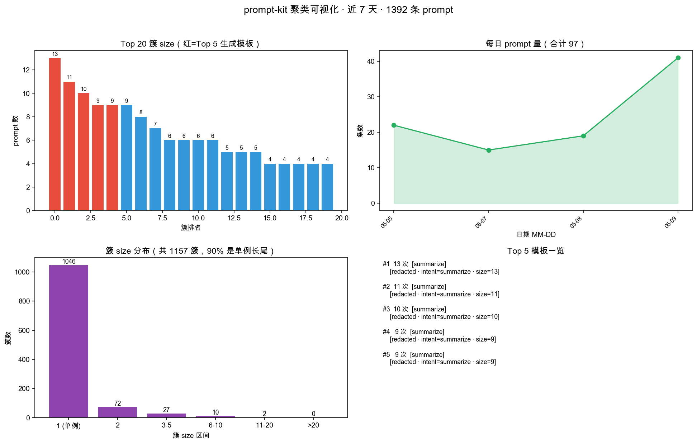

# CompoundMe

> Your AI collaboration, compounding. See it (L1) → standardise it (L2) → automate it (L3) → let your digital twin handle it (L4).

**CompoundMe** is a local-first toolkit for building your own personal-twin stack from the daily AI-coding sessions you already have. It ships two pieces:

- **MirrorCop** (`src/`) — the L1 mirror. Parses Claude Code / Codex CLI / Cursor session logs into a local SQLite database and turns those events into an ROI and asset evidence ledger.
- **prompt-kit** (`a_task_pool/mvp001/`) — the L2→L3 consumer. Mines the mirror DB for high-frequency prompts, turns them into reusable six-field YAML templates, and feeds them into a local task pool (auto / notify-after / approve-before channels).

Everything stays on your machine. No cloud, no vendor lock-in, no prompt data ever leaves `~/.ai-trace/`.

---

## The L1 → L4 Ladder

| Layer | What it means | Where it lives |
|---|---|---|
| **L1 Digitise** | See what you actually do with AI every day | `src/ai_review_pipeline.py` → `~/.ai-trace/data/ai_review.db` |
| **L2 Standardise** | Cluster high-frequency prompts into six-field task templates | `a_task_pool/mvp001/scripts/prompt_kit_weekly.py` |
| **L3 Automate** | Route standardised tasks through auto / notify / approve channels | `a_task_pool/mvp001/cli.py` + `task_pool/router.py` |
| **L4 Twin** | Your digital twin executes recurring work on your behalf | Roadmap — L3's six-field contract is the plug point |

The core loop:

```
Use AI → Collect behavior → Classify & attribute → Asset-ize patterns → Reuse → Better AI use → More signal
```

This is not linear improvement. It compounds.

---

## What Makes It Different

| Existing tools | CompoundMe |
|----------------|-----------|
| LLM observability (Langfuse, Phoenix) | Personal collaboration attribution, not request-tracing |
| Prompt management | Prompts mined from your real sessions, not hand-curated |
| One-shot analysis | Recursive compounding — the more you use it, the sharper it gets |
| Cloud/team-first | Local-first, you own all data |

---

## From one author's own DB (anonymized)

Run on a real personal AI-session database (2200+ prompts across ~45 days, Claude Code / Codex / Cursor).
All typical prompt text is redacted via `--anonymize` before screenshotting — what you see is structure, not content:



- Top-left — the top 20 clusters by size (red = Top 5 that become YAML templates)
- Top-right — daily prompt volume over the window
- Bottom-left — cluster-size distribution (long tail: most prompts are one-offs; a small cluster of high-frequency ones is what compounds)
- Bottom-right — Top 5 template slots with intent + cluster size (prompt text redacted)

Reproduce on your own DB:

```bash
cd a_task_pool/mvp001
python scripts/viz_clusters.py --days 7 --anonymize --out docs/cluster_demo.png
```

---

## Features

- Parses local session files from **Claude Code**, **OpenAI Codex CLI**, and **Cursor**
- Ingests Cursor from both transcript JSONL and workspace `state.vscdb`
- Deduplicates and classifies prompts by category and preference signal
- Stores event metadata such as `session_id`, `turn_id`, `event_time`, `project_path`, `cwd`, `artifact_path`, and `artifact_type`
- Maintains a task ledger with `project_id`, outcome labels, prompt links, and artifact links
- Exports ROI, asset-effect, and data-quality reports as Markdown/JSON
- Stores everything in a local **SQLite** database — no cloud, no vendor lock-in
- Generates **daily** and **weekly** Markdown reports
- Optional **email alert** if the daily pipeline misses a run
- macOS **launchd** scheduler support via auto-generated plists
- Fully **config-driven** — all paths, schedules, and rules live in `app_config.json`

---

## Project Structure

```
compoundme/
├── src/                        # MirrorCop — L1 digitise
│   ├── config_loader.py        # Config loading with deep-merge defaults
│   ├── ai_review_pipeline.py   # Main pipeline: parse → store → report
│   ├── monitor_review.py       # Alert monitor: check if pipeline ran
│   ├── install_launchd.py      # macOS launchd plist generator + installer
│   ├── run_review.sh           # Shell wrapper for pipeline
│   └── monitor_review.sh       # Shell wrapper for monitor
├── config/
│   ├── app_config.example.json
│   └── mail_config.example.json
├── a_task_pool/mvp001/         # prompt-kit — L2 standardise / L3 automate
│   ├── scripts/prompt_kit_weekly.py    # mine DB → weekly report + YAML templates
│   ├── scripts/viz_clusters.py         # optional cluster visualisation
│   ├── cli.py                          # submit / run / list / approve / show
│   ├── task_pool/                      # six-field schema, pool, router
│   ├── executors/                      # echo / shell / stubs
│   ├── examples/                       # schema demos
│   └── templates/example_*.yaml        # scrubbed reference templates
└── README.md
```

---

## Quick Start

**Requirements:** Python 3.10+, macOS (for launchd scheduler) or any OS for manual runs.

### 1. Clone and configure

```bash
git clone https://github.com/CyAlcher/compoundme.git
cd compoundme

cp config/app_config.example.json config/app_config.json
# Edit config/app_config.json — set your source paths and output directories
```

### 2. Run manually

```bash
cd src
python3 ai_review_pipeline.py --config ../config/app_config.json
```

Reports are written to the `daily_root` directory defined in your config.

### 3. (Optional) Schedule with launchd on macOS

```bash
cd src
python3 install_launchd.py --config ../config/app_config.json --load
```

This generates and loads two launchd jobs:
- `compoundme-runner` — runs the pipeline daily at the configured hour
- `compoundme-monitor` — checks for missed runs and optionally sends an email alert

### 4. (Optional) Enable email alerts

```bash
cp config/mail_config.example.json config/mail_config.json
# Fill in your SMTP credentials and set "enabled": true
```

---

## Configuration

All behaviour is controlled by `config/app_config.json`. Key sections:

| Section | Purpose |
|---------|---------|
| `paths` | Where to store the DB, logs, state, and reports |
| `sources` | Paths to your local AI tool session directories |
| `filters` | Noise patterns and path substrings to exclude |
| `schedule` | Hour/minute for launchd runner and monitor jobs |
| `mail` | Path to mail_config.json for alert emails |
| `reports` | Folder naming pattern and report filenames |

See `config/app_config.example.json` for the full annotated template.

---

## Supported AI Tools

| Tool | Session path (default) | Format |
|------|----------------------|--------|
| Claude Code | `~/.claude/projects/**/*.jsonl` | JSONL |
| OpenAI Codex CLI | `~/.codex/sessions/**/*.jsonl` | JSONL |
| Cursor | `~/.cursor/projects/**/agent-transcripts/*.jsonl` and `**/state.vscdb` | JSONL + SQLite |

To add a new tool, implement a `parse_<tool>(path)` generator in `ai_review_pipeline.py` and add it to `sources` in your config.

---

## Prompt Categories

| Category | Description |
|----------|-------------|
| `code_reading` | Reading, tracing logic, understanding upstream/downstream |
| `code_modification` | Modifying, refactoring, fixing, replacing code |
| `env_tooling` | Environment setup, install errors, tool config |
| `prompt_experiment` | CoT, few-shot, ablation, stability testing |
| `structured_output` | Markdown, tables, reports, formatted output |
| `risk_assessment` | Planning, risk evaluation, impact analysis |
| `digital_asset` | Skills, templates, automation, personalization |
| `other` | Everything else |

---

## Database Schema

```sql
prompt_records (
  prompt_hash, tool, source_file, source_mtime, text, assistant, category,
  first_seen_date, last_seen_date, session_id, turn_id, parent_turn_id,
  event_time, project_path, cwd, source_kind, model_name, tool_call_name,
  artifact_path, artifact_type, outcome_status, task_confidence,
  input_tokens, output_tokens, cache_read_tokens
)

pipeline_runs (run_id, run_date, run_at, run_type, status,
               raw_session_count, unique_prompt_count, notes)

monitor_alerts (alert_key, alert_date, status, message, created_at)

task_runs (
  task_id, task_date, owner, task_type, task_name, project_id,
  delivery_type, delivery_status, rework_count,
  outcome_status, reuse_result, business_value, notes, created_at
)
task_prompt_links (task_id, prompt_hash)
task_artifacts (artifact_id, task_id, artifact_path, artifact_type, notes, created_at)
```

## MVP1 Task Ledger And Audit Reports

### Create a task

```bash
cd src
python3 task_ledger.py --config ../config/app_config.json create-task \
  --task-id task-20260325-report-01 \
  --task-date 2026-03-25 \
  --owner alice \
  --task-type report \
  --task-name "Client ROI recap" \
  --delivery-type markdown_report \
  --rework-count 1
```

### Link prompts to a task

```bash
cd src
python3 task_ledger.py --config ../config/app_config.json link-prompts \
  --task-id task-20260325-report-01 \
  --prompt-hash HASH_A HASH_B
```

### Export / import batch task review

```bash
cd src
python3 task_ledger.py --config ../config/app_config.json export-task-review \
  --start-date 2026-03-01 \
  --end-date 2026-03-31 \
  --output ../out/task_review.csv

python3 task_ledger.py --config ../config/app_config.json import-task-review \
  --input ../out/task_review.csv
```

### Auto-link artifacts from prompt evidence

```bash
cd src
python3 task_ledger.py --config ../config/app_config.json autolink-artifacts \
  --start-date 2026-03-01 \
  --end-date 2026-03-31 \
  --owner alice
```

### Generate data quality reports

```bash
cd src
python3 data_quality_report.py --config ../config/app_config.json \
  --start-date 2026-03-01 \
  --end-date 2026-03-31 \
  --owner alice \
  --output-dir ../out/data_quality
```

### Generate ROI audit report

```bash
cd src
python3 roi_audit_report.py --config ../config/app_config.json \
  --start-date 2026-03-01 \
  --end-date 2026-03-31 \
  --owner alice \
  --output ../out/roi_audit_report.md
```

### Export summary pack

```bash
cd src
python3 export_audit_pack.py --config ../config/app_config.json \
  --start-date 2026-03-01 \
  --end-date 2026-03-31 \
  --owner alice \
  --output-dir ../out/audit_pack
```

This writes:

- `audit_summary.md`
- `audit_manager_brief.md`
- `roi_audit_report.md`
- `client_summary.md`
- `owner_summary.md`
- `data_quality_report.md`
- `data_quality_report.json`

### Run tests

```bash
python3 -m pip install -r requirements.txt
python3 -m pytest
```

---

## Privacy

- All data stays **local** — nothing is sent to any external service
- Absolute home paths in prompt text are automatically redacted to `~`
- `.gitignore` excludes `data/`, `logs/`, `state/`, and all `*.db` files
- `mail_config.json` (SMTP credentials) is also excluded

---

## Roadmap

- [ ] T-day snapshot layer (daily delta, not just cumulative)
- [ ] Asset registry: track skills, prompts, and twins as first-class entities
- [ ] Before/after effect comparison for registered assets
- [ ] Token and turn-count tracking per session
- [ ] Higher-coverage result labels and artifact binding
- [ ] More robust project-level summaries for recurring delivery work
- [ ] **L4 Twin**: wire a real executor (Claude Code / n8n) behind the six-field contract so recurring work runs without you

---

## License

**Dual-licensed — non-commercial use is free, commercial use requires a paid license.** See [`LICENSE`](./LICENSE) for the full text.

- **Non-commercial** (personal use, academic research, evaluation, non-profit OSS contribution): free, subject to the attribution and naming conditions in the LICENSE.
- **Commercial** (paid products, SaaS, internal for-profit use, paid consulting / training built on this code, redistribution for a fee): requires a separate commercial license. Open a GitHub issue with the prefix `[commercial]` to start a conversation.

Copyright (c) 2026 CyAlcher. All rights reserved.

---

## L2 → L3: prompt-kit (a_task_pool/mvp001)

The L2 standardise step and L3 automate step live under `a_task_pool/mvp001/`.
`prompt_kit_weekly.py` mines the L1 mirror DB for high-frequency prompts and
turns them into reusable six-field YAML task templates; `cli.py` feeds those
templates into the local task pool's auto / notify / approve channels.

Quick start:

```bash
# 1. deps (isolated from the L1 mirror runtime if you like)
pip install -r a_task_pool/mvp001/requirements.txt

# 2. mine your own DB → weekly report + pk-*.yaml templates (gitignored; stay local)
cd a_task_pool/mvp001
python scripts/prompt_kit_weekly.py --days 7           # default reads ~/.ai-trace/data/ai_review.db

# 3. submit a scrubbed example (or your own mined template) into the local task pool
python cli.py submit templates/example_fetch.yaml

# 4. (optional) cluster visualisation
python scripts/viz_clusters.py --days 7
```

`templates/pk-*.yaml` are **your** mined artefacts (containing real prompt text)
and are gitignored. `templates/example_*.yaml` are scrubbed reference samples
safe to commit and share. Design notes live in `a_task_pool/自动化工作流方案.md`.

---

## Contributing

Issues and PRs welcome. Please do not commit any personal session data, API keys, or real prompt content in examples.

---

## Stay in Touch

Follow the WeChat official account for release notes, usage tips, and discussion on L1→L4 digital-twin practice. Scan below:

<p align="center">
  
</p>

For commercial licensing inquiries, see the [License](#license) section above or open a GitHub issue with the `[commercial]` prefix.
